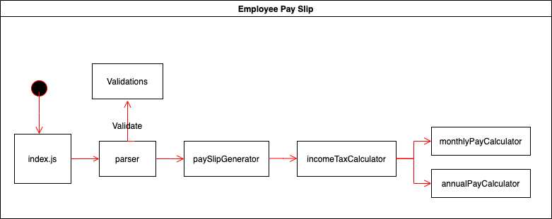

# Employee Monthly Pay Slip

## Contents

- [Description](#description)
- [Technology Stack](#technology-stack)
- [Get Started](#get-started)
- [Design and Architecture](#design-and-architecture)
- [Conclusion](#conclusion)

## Description

Create a console application that given employee annual salary details outputs a monthly pay slip.

Attributes of the employee are:

- name
- annual salary

Attributes of the monthly pay slip are:

- name
- gross monthly income = annual salary / 12 (months)
- monthly income tax = (annual tax rate as provided below) / 12 (months)
- net monthly income = gross monthly income - income tax

## The following annual tax rates apply:

| Taxable income     | Tax on this income            |
| ------------------ | ----------------------------- |
| $0 - $20,000       | \$0                           |
| $20,001 - $40,000  | 10c for each $1 over $20,000  |
| $40,001 - $80,000  | 20c for each $1 over $40,000  |
| $80,001 - $180,000 | 30c for each $1 over $80,000  |
| \$180,001 and over | 40c for each $1 over $180,000 |

---

For example, for an employee with an annual salary of \$60,000:

- gross monthly income
  = 60,000 /12
  = 5,000

- monthly income tax
  = ((20,000 \* 0) + ((40,000 - 20,000) \* 0.1) + (60,000 - 40,000) \* 0.2)) / 12
  = (0 + (20,000 \* 0.1) + (20,000 \* 0.2)) / 12
  = ( 0 + 2,000 + 4,000) /12
  = 500

- net monthly income
  = 5,000 - 500
  = 4,500

Here is example console input:

- GenerateMonthlyPayslip "Mary Song" 60000

and example output:

- Monthly Payslip for : "Mary Song"
- Gross Monthly Income: \$5000
- Monthly Income Tax: \$500
- Net Monthly Income: \$4500

## Technology Stack

- Javascript
- Mocha / Chai

## Get Started

Note: Please make sure to have node.js installed.

1. Navigate to the root directory and run:

   > npm install

2. Now run the application with:

   > npm start

3. You can run the test suite by:
   > npm test

## Design and Architecture

- Single responsibility principle was implemented to design the above architecture diagram.
- Recursion was used to calculate the total taxable amount on the annual income (See annualPayCalculator.js).
- Any constant/configurable data are stored in constants folder (Valid commands, Error messages, annual income tax table).
- Some error checking has been added to ensure valid commands & arguments are entered. Otherwise, it will throw an error.

## Testing

- I have implemented TDD during development, with proper unit testing. Please see test folder for the test cases.

## Assumptions

- I have made the assumption that if the annual salary entered is negative, to not generate the monthly payslip and instead, throw an error.
